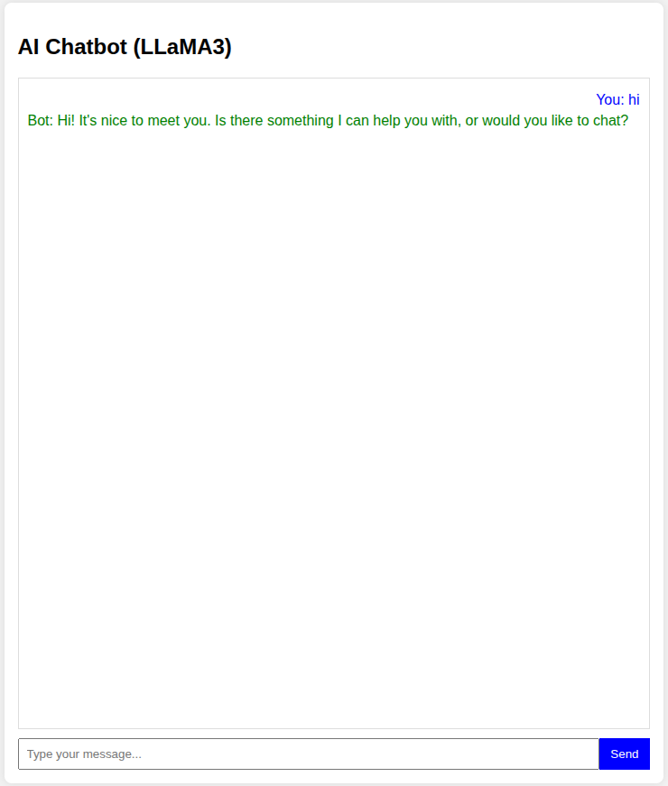

# 🤖 AI Chatbot – Powered by Llama 3 & FastAPI  

## 📸 Demo Preview  
  

## 📌 Project Overview  
This project is an **AI-powered chatbot** built using **Ollama’s Llama 3** model integrated with **FastAPI** for a high-performance backend and a clean, interactive **web-based user interface**. It is designed to provide seamless real-world conversational AI functionality with extendable tools and integrations.  

## 🚀 Features  
- 🧠 **AI Chatbot** – Powered by Llama 3 (via Ollama).  
- ⚡ **FastAPI Backend** – High-performance API for handling chat requests.  
- 💻 **Modern Web Interface** – Simple and intuitive UI for real-time interaction.  
- 🔌 **Extendable Tools** – Add custom tools and APIs for advanced chatbot capabilities.  
- 🛠️ **Open Source** – Easy to customize and integrate with other systems.  

## 🗂️ Tech Stack  
- **Backend:** FastAPI  
- **AI Model:** Ollama Llama 3  
- **Frontend:** HTML, CSS, JS (lightweight web interface)  
- **Others:** REST API, Python  

## 📦 Installation  

### 1️⃣ Clone the Repository  
```bash
git clone https://github.com/your-username/ai-chatbot.git
cd ai-chatbot
```

### 2️⃣ Install Dependencies  
```bash
pip install -r requirements.txt
```

### 3️⃣ Run FastAPI Backend  
```bash
uvicorn main:app --reload
```

### 4️⃣ Open Web Interface  
Visit:  
```
http://127.0.0.1:8000
```

## 🔧 Configuration  
- Make sure **Ollama** is installed and running locally.  
- Update model settings inside `config.py` if needed.  

## 📸 Screenshots  
(Add more screenshots here if needed)  

## 🤝 Contributing  
Contributions are welcome! Feel free to fork, open issues, and submit PRs.  

## 📜 License  
This project is licensed under the **MIT License** – free to use, modify, and distribute.  
